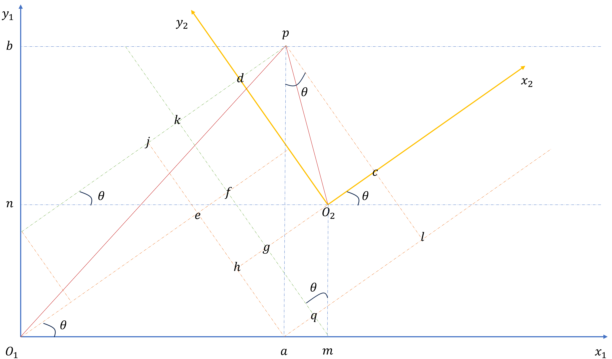

# 两个坐标系的转换矩阵求解

坐标系 $o_1x_1y_1$ 转换到坐标系 $o_2x_2y_2$ 转换矩阵 $T^{o_2}_{o_1}$ 的推导和记忆方法

## 推导

已知

$$
\begin{align}
o_1m &= t_1 \\
o_1n = o_2m &= t_2 \\
o_1a &= x \\
o_1b = ap &= y \\
\end{align}
$$

求

$$
\begin{align}
o_2c = pd &= x' \\
o_2d = cp &= y'
\end{align}
$$

可得

$$
\begin{align}
o_1e &= xcos\theta \\
ae = qf &= xsin\theta \\
mf &= t_1sin\theta \\
o_1f &= t_1cos\theta \\
gm &= t_2cos\theta \\
o_2g = kd &= t_2sin\theta \\
pl = qk &= ycos\theta \\
al = pj &= ysin\theta \\
mq = mf-qf &= t_1sin\theta-xsin\theta \\
jk = ef = o_1f-o_1e &= t_1cos\theta-xcos\theta
\end{align}
$$

求得

$$
\begin{align}
y' = gk = mk-mg = qk+mq-mg &= ycos\theta+(t_1sin\theta-xsin\theta)-t_2cos\theta \\
x' = pd = pj-jk-kd &= ysin\theta-(t_1cos\theta-xcos\theta)-t_2sin\theta
\end{align}
$$

表示为矩阵形式

$$
\left[\begin{matrix}
x' & y' & 1
\end{matrix}\right]^{T} = \left[\begin{matrix}
cos\theta & sin\theta & -t_1cos\theta-t_2sin\theta \\
-sin\theta & cos\theta & t_1sin\theta-t_2cos\theta \\
0 & 0 & 1
\end{matrix}\right]
\left[\begin{matrix}
x & y & 1
\end{matrix}\right]^{T}
$$

即

$$
T^{o_2}_{o_1}=
\left[\begin{matrix}
cos\theta & sin\theta & -t_1cos\theta-t_2sin\theta \\
-sin\theta & cos\theta & t_1sin\theta-t_2cos\theta \\
0 & 0 & 1
\end{matrix}\right]
$$

## 记忆法

坐标系 $o_1x_1y_1$ 转换到坐标系 $o_2x_2y_2$ 转换矩阵 $T^{o_2}_{o_1}$ 看着很复杂，其实非常好记。

坐标系 $o_2x_2y_2$ 转换到坐标系 $o_1x_1y_1$ 转换矩阵 $T^{o_1}_{o_2}$ 为：

$$
T^{o_1}_{o_2}=
\left[\begin{matrix}
cos\theta & -sin\theta & t_1 \\
sin\theta & cos\theta & t_2 \\
0 & 0 & 1
\end{matrix}\right]
$$

转换矩阵的逆为

$$
T^{o_2}_{o_1}=(T^{o_1}_{o_2})^{-1}=

\left[\begin{matrix}
R^{T} & -R^{T}t \\
0 & 1
\end{matrix}\right] \\

R =
\left[\begin{matrix}
cos\theta & -sin\theta \\
sin\theta & cos\theta \\
\end{matrix}\right] \\

t =
\left[\begin{matrix}
t_1 \\
t_2 \\
\end{matrix}\right] \\
$$

简单矩阵运算即可求得

$$
R^{T} =
\left[\begin{matrix}
cos\theta & sin\theta \\
-sin\theta & cos\theta \\
\end{matrix}\right] \\

-R^{T} =
\left[\begin{matrix}
-cos\theta & -sin\theta \\
sin\theta & -cos\theta \\
\end{matrix}\right] \\

-R^{T}t =
\left[\begin{matrix}
-t_1 cos\theta -t_2 sin\theta \\
t_1 sin\theta - t_2 cos\theta \\
\end{matrix}\right] \\

T^{o_2}_{o_1}=(T^{o_1}_{o_2})^{-1}=

\left[\begin{matrix}
R^{T} & -R^{T}t \\
0 & 1
\end{matrix}\right] =

\left[\begin{matrix}
cos\theta & sin\theta & - t_1 cos\theta - t_2 sin\theta \\
-sin\theta & cos\theta & t_1 sin\theta- t_2 cos\theta \\
0 & 0 & 1 \\
\end{matrix}\right] \\
$$

所以坐标系 $o_1x_1y_1$ 转换到坐标系 $o_2x_2y_2$ 需要平移 $t_1$ 和 $t_2$ ，逆时针旋转 $\theta$ 时，只需建立对应参数的转换矩阵，再求逆即可。
